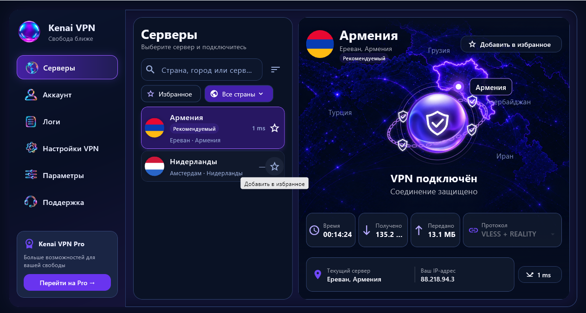

# Kenai VPN — приложение для Windows

VPN-клиент для Windows 10/11: выберите сервер, активируйте доступ и подключитесь к защищённому соединению. Интерфейс построен на **Flutter/Dart**, системная служба — на **Rust**. VPN-движки: **AmneziaWG** и **Xray-core (VLESS + REALITY)**; в коде также сохранён адаптер WireGuard.



## Разделы приложения

1. **Серверы** — выбор страны и сервера, поиск, избранное, задержка, подключение и статистика трафика.
2. **Аккаунт** — активация по ключу, сведения о доступе и подписке.
3. **Логи** — журнал событий и диагностика подключения с маскированием секретов.
4. **Настройки VPN** — выбор доступного протокола и параметры VPN-соединения.
5. **Параметры** — настройки поведения приложения: автозапуск, подключение и работа в трее.
6. **Поддержка** — отправка обращения и переписка со службой поддержки.

## Как подключается

Клиент обращается по HTTPS к API [админ-панели](https://github.com/pasha-tsaran/admin-panel), активирует ключ и получает параметры доступа. Через локальный защищённый IPC он передаёт профиль Windows-службе. Служба хранит его с защитой DPAPI, запускает выбранный VPN-движок и управляет маршрутами и DNS. Трафик идёт через VPN-узел, а панель управляет доступом.

## Зависимости и запуск

Нужны Flutter с поддержкой Windows, Rust и инструменты сборки Visual Studio. Основные библиотеки: `flutter_secure_storage` для защищённого хранения, `ffi`/`win32` для Windows, `pdfrx` для просмотра PDF; собственные пакеты `kenai_core` и `kenai_ui`. Состав и лицензии VPN-компонентов — в `third_party/`.

```powershell
flutter pub get
cd apps/desktop
flutter run -d windows
```

Debug-сборка использует демонстрационные адаптеры. Для реального подключения нужны серверное API, ключ доступа и установленная Windows-служба. Параметры release-сборки и установщика описаны в [руководстве разработчика](DEVELOPMENT.md).

## Проверки

```powershell
cd apps/desktop
flutter test
cd ../../packages/kenai_core
flutter test
cd ../kenai_ui
flutter test
cd ../..
cargo test --workspace --locked
```

Исходники разделены на интерфейс (`apps/desktop`), общую логику (`packages`), IPC-контракты (`crates`) и системную службу (`services`).
